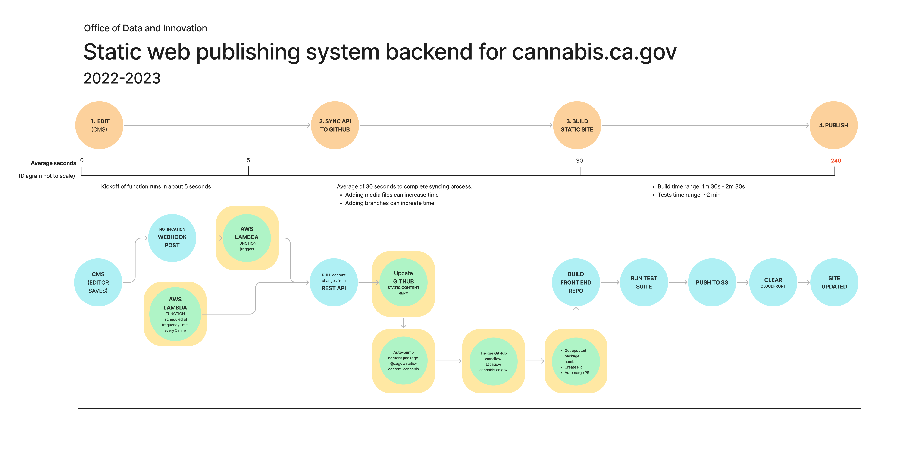

# cannabis.ca.gov

## Project description
Production instance of [cannabis.ca.gov](https://cannabis.ca.gov) for the Department of Cannabis Control (DCC). 
* Built to deliver plain-language, performant, accessible information.

## How our static publishing system works
### 1. Edit content
* Content is created and edited by DCC staff in a WordPress instance hosted by Pantheon at api.cannabis.ca.gov.
* All media are uploaded to a static S3 bucket on AWS.

### 2. Sync content to static content repo
* After posts are edited, a notification is fired off, and an AWS Lambda [syncing service](https://github.com/cagov/cannabis-ca-gov-lambda-sync-github) pulls data from WordPress through the WordPress REST API.  Notifications are produced using the Wordpress plugin 'Notifications' from [BracketSpace](https://bracketspace.com/).
* The data (with the exception of the uploaded media) is processed and loaded into a [static content package](https://github.com/cagov/static-content-cannabis). 

### 3. Update static site
This repo uses [11ty](https://11ty.dev) as a static site builder.
* When this repo is installed, `npm` will get the site content and make it available to the 11ty build.
* The `./src/.eleventy.js` script generates a static build of the site.

### 4. Publish
We use [GitHub Actions](https://docs.github.com/en/actions) workflows to manage publishing and site builds.
* Our `.yml` scripts manage how the site is published.
* The general process is to build the site, sync the site to the AWS S3 bucket, then invalidate the AWS CloudFront cache.
* Workflow files are found at: [`main`](./.github/workflows/eleventy_build_main.yml), [~`staging`~](./.github/workflows/eleventy_build_staging.yml) 
* When submitting a pull request (PR), a separate instance of the site is available through a link in the PR. [PR Previews](./.github/workflows/eleventy_build_pr.yml)

### System diagram

## Developer notes

### Installation
* Make sure `npm` and `node` are installed locally. Current version: Node 16.x, npm 8.5.0.
* `npm install` - install the packages in `package.json` and development dependencies.
* `npm run dev` for local builds.
* `npm build` to generate static repo at `./docs`. You can also run `http-server` or `serve` to view this site in a local web server.
* `npm run content:clean` and `npm run content:update` will get the latest content changes and reset content.
* You can work locally with the markup generated from https://api.cannabis.ca.gov editor. 
* [NOT YET RE-RELEASED]: `npm test` - run playwright tests.
* Check the [CHANGELOG](CHANGELOG.md), [ROADMAP](ROADMAP.md) for additional information.

### Tips
* All Eleventy configuration settings are located at `./config`. We use multiple branches and production, stating, and other branches, and this configuration file is the source of truth for all settings.
* The content is copied from `node_modules/static-content-cannabis` into `./pages/_content` and used at runtime. 
* The `./pages/_content.11tydata.js` file is where any domains from the edit are replaces and made relative to the static/headless instance.
* CA Design System components are located at `./src/components`, and managed via `package.json`. Any custom components are also located in this folder.
* Design tokens can be found in `./src/css`. 

### Cannabis local ordinances map
* See [README](./src/components/charts/cannabis-local-ordinances/README.md)

### Project management and updates
* Submit a pull request to the latest release branch: `release/2.x.x` etc.
* We use a task board in Coda to manage our support issues and past development. 
* For future development, use the desired project management tool.
* If a public issue trail is desired, we recommend creating tickets for concrete code tasks that pertain to the code, and linking the issue in any all team internal tracking tools.

### Troubleshooting
* Check the status of [GitHub Actions](https://github.com/cagov/cannabis.ca.gov/actions) to see if the site built.
* Check status of [AWS](https://health.aws.amazon.com/health/status), [Github](https://www.githubstatus.com/)
* Please refer to https://github.com/cagov/static-content-cannabis for more detailed technical notes on how the publishing system is built.

## Design system components
This project leverages several components that are part of the <a href="https://designsystem.webstandards.ca.gov/">California Design System</a>. These components are maintained in the <a href="https://github.com/cagov/design-system">design system repository</a>, published to `npm`, installed into this project and integrated in to the templates, css and javascript build steps as directed in those project READMEs.

Components included are listed as production dependencies in this project's package.json and are all identifiable because they are published on npm under the @cagov/ organization's prefix. These components are periodically created and updated by the Design System team. Be aware if the update has impact on the markup, as the companion code may need to be updated in the WordPress editor through the Gutenberg Blocks plugin, and or some legacy markup will need to be updated manually. 

Examples:
- @cagov/ds-accordion
- @cagov/ds-agency-footer
- @cagov/ds-back-to-top
- @cagov/ds-branding
- @cagov/ds-button-grid
- @cagov/ds-content-navigation
- @cagov/ds-dropdown-menu
- @cagov/ds-feature-card
- @cagov/ds-feedback
- @cagov/ds-link-icon
- @cagov/ds-pagination
- @cagov/ds-regulatory-outline
- @cagov/ds-skip-to-content
- @cagov/ds-statewide-footer
- @cagov/ds-statewide-header
- @cagov/ds-step-list
- @cagov/ds-table

## Team maintenance notes
Office of Digital Innovation (ODI), is working with the Department of Cannabis Control (DCC), Department of Consumer Affairs (DCA), and the California Department of Technology (CDT) to bring content strategy, user-centered design and performant web publishing on an open-source stack for DCC.

* Project docs: Coda and Google Drive
* Report an issue: https://github.com/cagov/cannabis.ca.gov
* Project board: Internal board is in Coda
* Public board: Would move to the GitHub board relative to this GitHub repository.
* Project maintainer & Lead Engineer: Jim Bumgardner @jbum; Alum: Chach Sikes (she/her) @chachasikes
* Engineering Management Lead: Zakiya Khabir @zakiyarules
* Slack channels: #odi-cannabis (ODI internal team channel), #cagov-cannabis (Multi-partner channel)
* Content guide: In Coda workspace

* (DEPRECATED) Project board: https://github.com/orgs/cagov/projects/6. 
